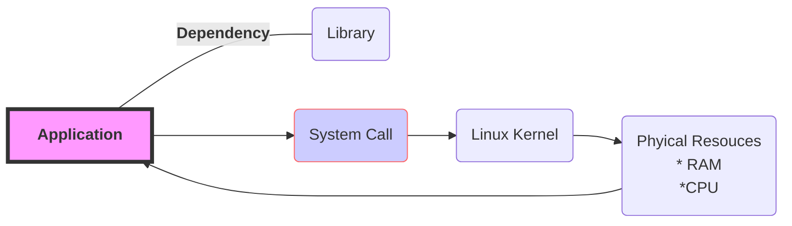



> Written by [lingjie](mailto:zhulingjie93@gmail.com).

### Application Stack 
In Linux, there are two distinct spaces, the user space and the kernel space. When the user runs an application, it will issue a system call, `read, write, open etc`,  then the kernel will allocate physical resources to the application. Also the application will have dependencies to the library. As illustrated by the graph below. 

To trouble shoot application issues, usually they fall into: 
* Library dependency issues
* Issue can be resolved from syscall

